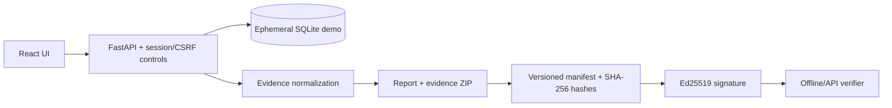

# Engineering case study

## Product boundary

This project turns synthetic or self-hosted security evidence into a portable, signed procurement pack. The public demo is disposable: it stores no customer data, exposes no OAuth integrations, and resets the synthetic workspace whenever a demo session begins.

Both production OAuth integrations use single-use, ten-minute state records plus RFC 7636
S256 PKCE. The verifier is encrypted at rest, consumed before token exchange, and never
returned to the browser.

## Architecture

## Trust boundaries

- Browser input is untrusted and validated by the API.
- Imports accept CSV only and enforce a one-megabyte limit.
- Provider tokens remain encrypted at rest and never enter exports.
- Every mutating authenticated request requires the session cookie and matching CSRF token.
- Public verification accepts at most 20 MB and performs no extraction to disk.

## Five-minute demonstration

1. Open the hosted demo and select **Try synthetic demo**; allow up to one minute for a free instance cold start.
2. Inspect the seeded twelve-control snapshot.
3. Generate and download the security pack.
4. Run `cd backend && python verify_pack.py ../dk-security-pack.zip`.
5. Modify any archived report and confirm verification returns a non-zero exit code.

## Limitations

The free demo is not production infrastructure: storage and signing keys are ephemeral, no customer uploads should be used, and OAuth collection is disabled. Production use requires durable Postgres, controlled key custody, backups, monitoring, and organization-specific assurance review.
